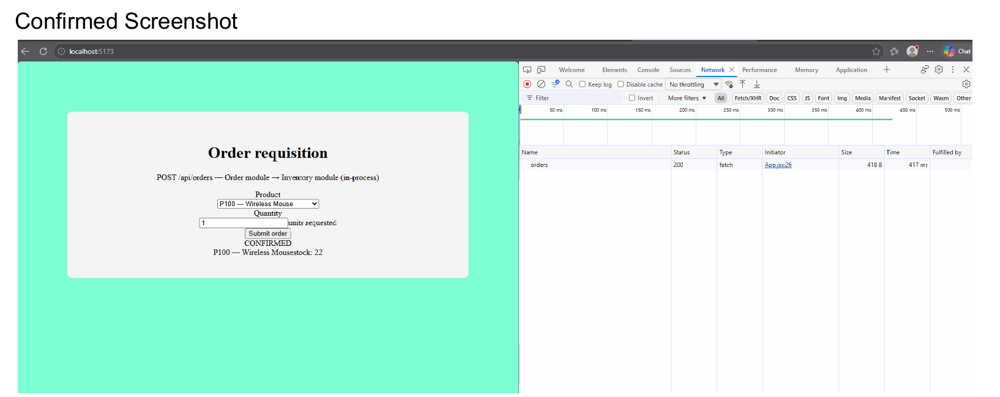
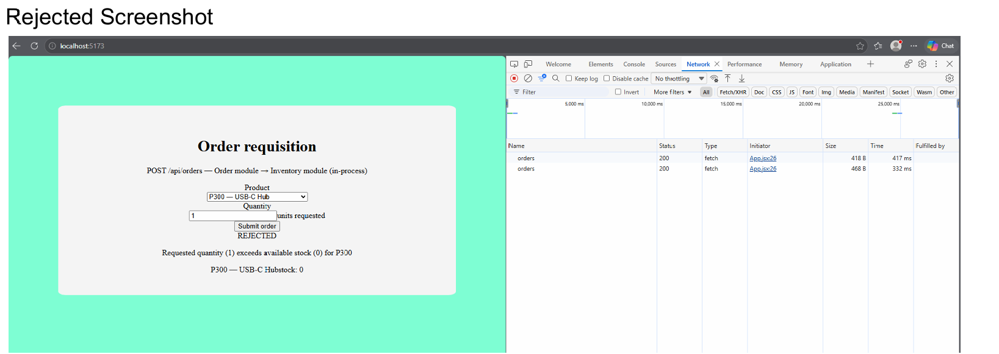
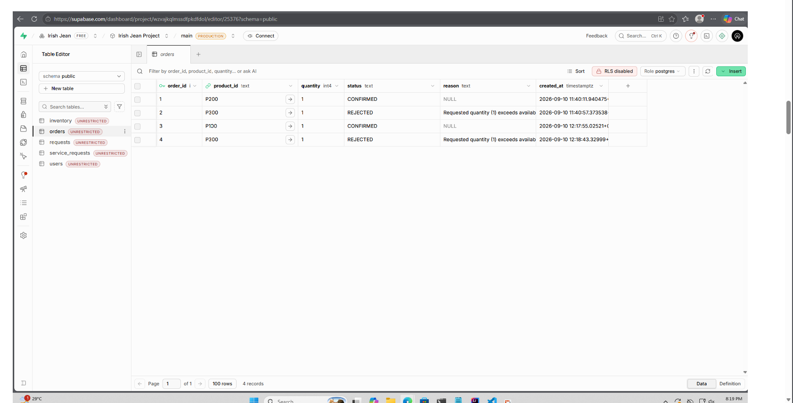

# Manubag_IT342_ModularMonolithIntegration
# LAB1

### Network tab evidence lab 1
 
- InventoryServiceImpl must be package-private --> Order module may depend only on the InventoryService interface (constructor injection)
  
 
- Supabase credentials must be kept out of the repo (environment variables / .gitignore'd config)
  
 
- Test both the confirmed and rejected paths end-to-end and capture Network tab evidence
  

# Order + Inventory Integration Lab

A single Spring Boot application with two in-process modules — **Order**
(`edu.cit.manubag.shop`) and **Inventory** (`edu.cit.manubag.inventory`) —
backed by a shared Supabase (Postgres) database, plus a React (Vite)
frontend that talks to it over REST.

```
order-inventory-integration/
├── backend/     Spring Boot app (Order + Inventory modules)
├── frontend/    React (Vite) client
├── sql/         schema.sql — table creation + seed data
└── README.md
```

## Architecture at a glance

- `edu.cit.manubag` — parent package, holds `@SpringBootApplication`
  so component scanning picks up both modules.
- `edu.cit.manubag.inventory` — owns the `inventory` table. Exposes one
  public seam, the `InventoryService` interface. The implementation,
  `InventoryServiceImpl`, is **package-private** — it cannot be
  referenced, injected, or instantiated from outside this package.
- `edu.cit.manubag.shop` — owns the `orders` table. `OrderService` takes
  an `InventoryService` in its constructor (interface only) and calls
  `reserve(...)` as a plain in-process Java method call — no HTTP, no
  serialization, same transaction.
- `edu.cit.manubag.config` — CORS configuration for the Vite dev server.

## 1. Supabase setup

1. Create a free project at [supabase.com](https://supabase.com).
2. In the Supabase dashboard, go to **Project Settings → Database** and
   copy the connection string (use the "Session pooler" or direct
   connection URI, port 5432), your database user (usually `postgres`),
   and your database password.
3. Open the **SQL editor** in Supabase, paste the contents of
   `sql/schema.sql`, and run it. This creates `inventory` and `orders`
   and seeds:
   | product_id | name                | stock |
   |------------|---------------------|-------|
   | P100       | Wireless Mouse      | 25    |
   | P200       | Mechanical Keyboard | 10    |
   | P300       | USB-C Hub           | 0     |
4. Confirm both tables show up under **Table Editor** with the seeded
   rows.

## 2. Backend setup

Credentials are read **only** from environment variables — nothing
secret is committed (`.env` is git-ignored; `.env.example` is the
template).

```bash
cd backend
cp .env.example .env
# edit .env with your real Supabase connection string, user, password
```

Export the variables (or use a tool like `direnv` / your IDE's run
configuration) and run:

```bash
export SUPABASE_DB_URL="jdbc:postgresql://YOUR-PROJECT-REF.supabase.co:5432/postgres?sslmode=require"
export SUPABASE_DB_USER="postgres"
export SUPABASE_DB_PASSWORD="your-db-password"

./mvnw spring-boot:run
```

The API starts on `http://localhost:8080`.

**Try it directly:**

```bash
# Confirmed
curl -X POST http://localhost:8080/api/orders \
  -H "Content-Type: application/json" \
  -d '{"productId":"P100","quantity":2}'

# Rejected (P300 has 0 stock)
curl -X POST http://localhost:8080/api/orders \
  -H "Content-Type: application/json" \
  -d '{"productId":"P300","quantity":1}'
```

## 3. Frontend setup

```bash
cd frontend
cp .env.example .env    # VITE_API_BASE_URL=http://localhost:8080
npm install
npm run dev
```

Open `http://localhost:5173`, pick a product, enter a quantity, and
submit. The result area shows `CONFIRMED` or `REJECTED` along with the
post-order inventory snapshot.

## 4. Network tab evidence

> _Replace this section with your own screenshots before submitting._

**Confirmed order** — e.g. P100, quantity 2, against a fresh Supabase
project seeded per `sql/schema.sql`:

```
[ screenshot: DevTools → Network → POST /api/orders → Payload tab
  showing { "productId": "P100", "quantity": 2 } ]

[ screenshot: same request → Response tab showing
  { "status": "CONFIRMED", "reason": null,
    "inventory": { "productId": "P100", "name": "Wireless Mouse", "stock": 23 } } ]
```

**Rejected order** — P300 (seeded with 0 stock):

```
[ screenshot: DevTools → Network → POST /api/orders → Payload tab
  showing { "productId": "P300", "quantity": 1 } ]

[ screenshot: same request → Response tab showing
  { "status": "REJECTED",
    "reason": "Requested quantity (1) exceeds available stock (0) for P300",
    "inventory": { "productId": "P300", "name": "USB-C Hub", "stock": 0 } } ]
```

Also confirm in the Supabase **Table Editor** that each attempt wrote a
row to `orders` with the matching `status` and `reason`, and that
`inventory.stock` only changed for the confirmed order.

## 5. Reflection

**1. In-process vs. separate microservices over a network — what do you
get for free, and what would you need to add back if split?**

Right now, `OrderService` calling `InventoryService.reserve(...)` is a
plain Java method call inside the same JVM, inside the same Spring
transaction. That buys a lot for free. The call is synchronous and
type-safe — the compiler checks the method signature, so there's no
chance of a malformed payload or a silent contract drift between
caller and callee. It's fast: no serialization, no network hop, no
retry logic needed because there's effectively nothing to fail in
transit. Most importantly, `@Transactional` on `OrderService.placeOrder`
means the inventory reservation and the order row write share one
database transaction — if anything after the reservation throws, the
whole thing rolls back atomically, including the stock decrement.
There's no way to end up with a confirmed order and unreserved stock,
or vice versa.

If Inventory were split into its own microservice reachable over HTTP,
all of that has to be rebuilt deliberately. The call becomes a network
request, so I'd need timeouts, retries with backoff, and a circuit
breaker for when Inventory is slow or down. Serialization means the
contract is now a JSON schema instead of a Java interface, which needs
versioning and consumer-driven contract tests to avoid silently
breaking Order when Inventory changes its response shape. Atomicity is
the big one: a single database transaction can't span two services'
databases, so "reserve stock, then write the order" becomes a
distributed transaction problem — solved with something like a saga
(reserve stock, then confirm/compensate) or an outbox + eventual
consistency pattern, accepting that for a short window the two systems
can disagree. I'd also need service discovery, independent deployment
and versioning, and observability (distributed tracing, correlation
IDs) to debug a request that now spans two processes instead of one
stack trace.

**2. Why does package-private visibility on `InventoryServiceImpl`
matter for the module boundary — what breaks if it's public?**

Package-private turns the module boundary from a convention into
something the compiler enforces. Because `InventoryServiceImpl` isn't
visible outside `edu.cit.manubag.inventory`, the Order module
physically cannot `new InventoryServiceImpl(...)`, cannot declare a
field or parameter of that type, and cannot downcast an injected
`InventoryService` back down to it to reach implementation details.
Spring's dependency injection still works fine because Spring resolves
the interface to the bean at runtime from within the same module, so
nothing about wiring breaks — only what other packages are allowed to
see changes.

If `InventoryServiceImpl` were public, nothing stops Order module code
from injecting or instantiating the concrete class directly, bypassing
the interface. That reintroduces exactly the coupling a module
boundary exists to prevent: Order code could reach into
`InventoryRepository` if it were public too, or rely on
implementation-specific behavior (locking strategy, exception timing)
that isn't part of the published contract. Once one caller does that,
refactoring `InventoryServiceImpl` — changing its constructor, its
locking approach, swapping it for a different implementation — risks
breaking Order in ways that don't show up until compile time in the
best case, or runtime in the worst. The interface is the only thing
that's supposed to be a stable contract; the implementation should be
free to change without notifying anyone who only depends on
`InventoryService`.

**3. When would you extract Inventory into its own microservice, and
what would need to change in your code to do it?**

I'd extract it when Inventory's scaling, deployment, or ownership needs
diverge enough from Order's that keeping them together costs more than
splitting them. Concretely: if inventory reads/writes become a hot
path that needs to scale independently of order traffic; if a separate
team owns inventory and wants to deploy on its own schedule without
coordinating releases with the Order team; if other systems besides
Order (a warehouse app, a supplier integration) need to read/write
inventory and shouldn't have to go through Order's process to do it;
or if Inventory's data model needs a different database technology or
sharding strategy than Order's.

To actually do it, `InventoryService` stays as the contract
conceptually, but its implementation moves behind an HTTP (or
messaging) API in a separate deployable. In the Order module, I'd
replace the direct Spring-injected `InventoryService` bean with an
HTTP client adapter that implements the same interface but makes a
REST call under the hood — so `OrderService` itself barely changes,
since it only ever depended on the interface. I'd add resilience
(timeouts, retries, a circuit breaker), a versioned API contract
instead of a shared Java type, and rework the transaction boundary
since a single `@Transactional` can no longer cover both the
reservation and the order write — likely a saga: reserve stock via the
Inventory API, then write the order as CONFIRMED, with a compensating
"release stock" call if the order write fails afterward. Inventory
would get its own database (no more sharing the Supabase instance with
Order), its own deployment pipeline, and its own observability. The
fact that Order was built against an interface from day one is what
makes this swap contained instead of a full rewrite.

---

## Requirements checklist

- [x] `edu.cit.manubag.shop` (Order) / `edu.cit.manubag.inventory`
      (Inventory) package naming, `@SpringBootApplication` in
      `edu.cit.manubag`
- [x] `inventory` / `orders` tables, seeded per spec (`sql/schema.sql`)
- [x] JPA/JDBC connection via env vars only (`application.properties`,
      `.env.example`)
- [x] `InventoryService.getItem` / `reserve`, rejects over-quantity
      requests
- [x] `OrderService` calls `InventoryService` in-process, writes to
      `orders`, returns CONFIRMED/REJECTED
- [x] `POST /api/orders` with the specified request/response shape
- [x] CORS enabled for `http://localhost:5173` (overridable via env var)
- [x] React product dropdown, quantity input, submit, result area
- [x] `InventoryServiceImpl` is package-private; Order module depends
      only on `InventoryService` via constructor injection
- [ ] Network tab evidence — add your screenshots to section 4 above


# LAB 2
## 9/17/2026

 ### Network tab evidence lab2
 
- A multi-item order where all items succeed (CONFIRMED)
  
 
- A multi-item order where one item fails and the whole order is REJECTED with no partial reservation
  
 
- A cancel with restock reflected in GET /api/inventory afterward
  
 
- The notification feed showing a confirmed order, a rejected order, and a low-stock alert
  
 
1. Multi-item orders and atomicity
 
When a customer places an order containing multiple items, `OrderService` calls `InventoryService` several times to reserve the requested quantities. Since both modules run inside the same Spring Boot application and share the same database transaction, the `@Transactional` annotation on the order placement method ensures atomicity. If one item is unavailable or an error occurs during processing, the transaction can roll back all inventory changes and the order write. This prevents partial reservations and inconsistent order records. If Order and Inventory were split into separate microservices, a single database transaction would no longer cover both services. I would need a saga or compensating transactions, such as releasing previously reserved stock if a later reservation fails.
 
2. Event publishing and Notification coupling
 
Publishing an event instead of calling Notification directly reduces coupling between `OrderService` and the Notification module. OrderService only needs to publish an event, such as `OrderConfirmed`, without knowing how notifications are created or delivered. Notification can listen for that event and decide whether to send an email, SMS, or another message. This makes the modules easier to maintain and allows Notification to change its implementation without requiring changes to OrderService. If Notification became a separate microservice, I would introduce a message broker such as RabbitMQ or Kafka. I would also consider delivery guarantees, retries, duplicate-message handling, and a dead-letter queue to manage failed notifications.
 
3. Choosing the first module to extract
 
If I had to extract exactly one module into its own microservice, I would choose Notification. It is triggered by events and does not need to participate directly in the order and inventory database transaction. This makes it easier to separate without disrupting the core ordering process. Notification could independently scale when many messages need to be sent and could use its own deployment pipeline. To extract it, I would replace the in-process event listener with a message broker connection, create a separate Notification application, and configure it to consume order events. I would also add retry handling, message acknowledgment, and monitoring for delivery failures.
 
4. Conclusion
 
This integration demonstrates how modular monolith architecture provides clear boundaries while keeping communication simple and transactions manageable. Separating modules into microservices should happen when independent scaling, deployment, or ownership justifies the additional complexity of network communication, distributed transactions, and message delivery management.
has context menu
